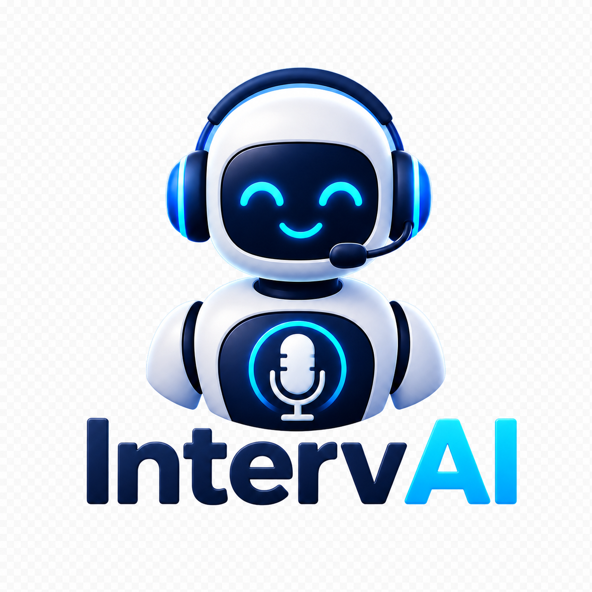
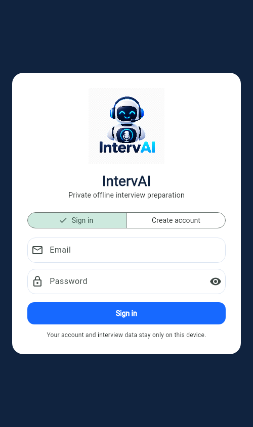
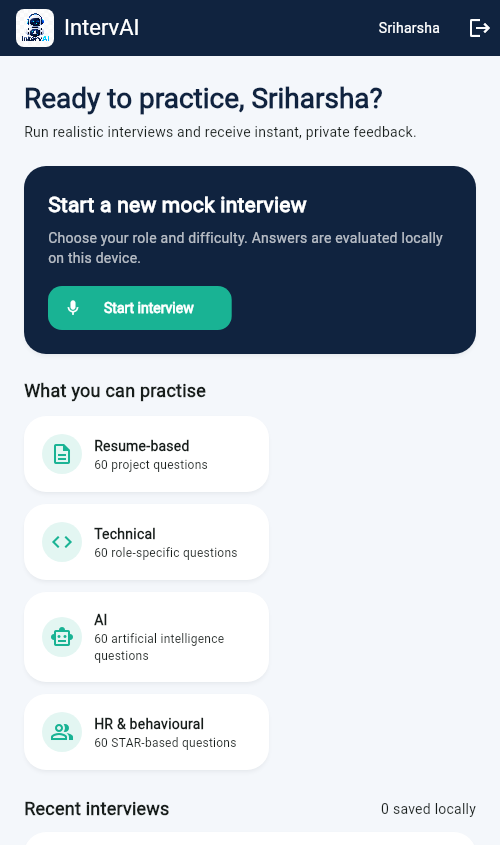
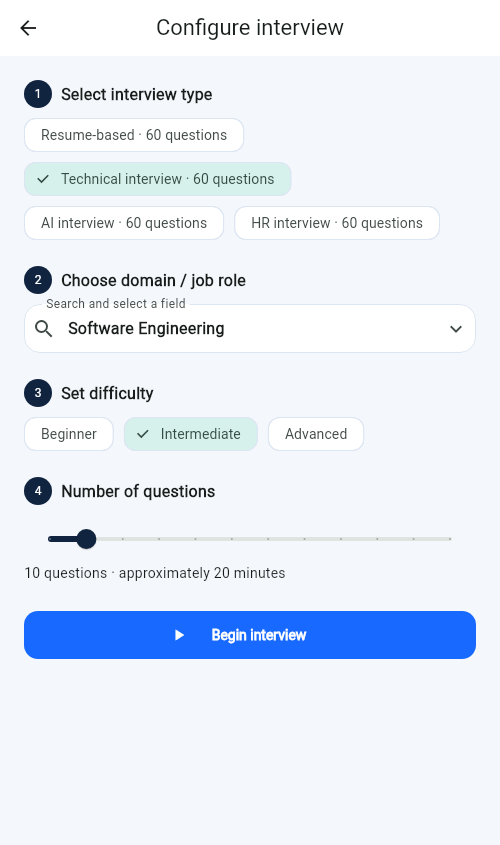
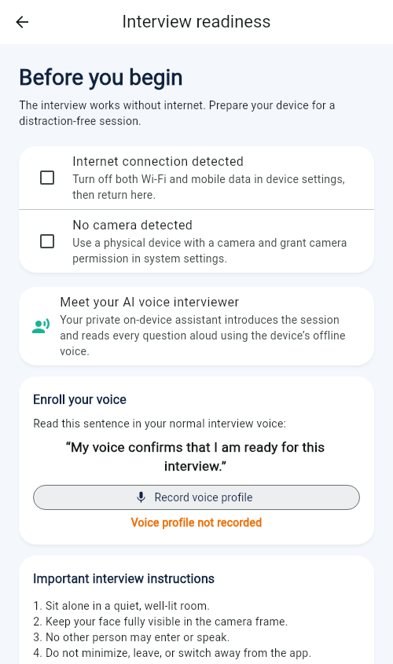

<div align="center">
  

  # IntervAI

  ### Private, offline AI-powered interview preparation

  Practise realistic interviews, strengthen every answer, and review actionable feedback—without sending your interview data to the cloud.

</div>

---

## Why IntervAI?

Interview practice should feel realistic without sacrificing privacy. IntervAI provides a complete preparation workflow on the candidate's device: choose an interview, answer role-specific questions, receive explainable scores, identify weak topics, and revisit previous sessions.

The app is designed for students, job seekers, and anyone who wants repeatable interview practice without depending on a cloud API during a session.

## Product tour

<p align="center">
  
  &nbsp;
  
  &nbsp;
  
</p>

<p align="center">
  <em>Private sign-in · Candidate dashboard · Flexible interview setup</em>
</p>

<details>
  <summary><strong>View the interview-readiness screen</strong></summary>
  <br />
  <p align="center">
    
  </p>
</details>

## Highlights

| Capability | What it provides |
| --- | --- |
| Multiple interview modes | Resume-based, technical, AI, and HR/behavioural practice |
| Role-specific preparation | Searchable domains including software engineering, data science, cybersecurity, and product roles |
| Adjustable sessions | Beginner, intermediate, or advanced difficulty with 5–60 questions |
| Explainable evaluation | Relevance, keyword coverage, clarity, fluency, filler-word usage, and STAR-structure scoring |
| Offline voice experience | On-device question narration plus local voice enrolment and verification |
| Readiness checks | Connectivity, camera, microphone, and interview-rule confirmation before a session |
| Local proctoring | Camera-based presence monitoring, app-switch detection, and a three-warning policy |
| Actionable reports | Per-answer scores, ideal-answer comparison, weak-topic detection, and improvement guidance |
| Private history | Candidate profile, completed sessions, and reports stored locally on the device |

## How it works

```text
Create or sign in to a local profile
                ↓
Choose interview type, role, difficulty, and length
                ↓
Complete offline readiness and voice-enrolment checks
                ↓
Answer role-specific questions with on-device narration
                ↓
Receive explainable feedback and a private local report
```

## Complete interview journey

### 1. Create a local candidate profile

IntervAI begins with a lightweight on-device account. The candidate's name and sign-in state are stored with `SharedPreferences`, allowing the dashboard and interview history to remain available between launches. This flow does not contact a remote authentication server.

### 2. Configure a focused practice session

Candidates can customise each session instead of practising from a fixed playlist:

- Select resume-based, technical, AI, or HR/behavioural questions.
- Search for a target domain or job role.
- Choose beginner, intermediate, or advanced difficulty.
- Set the session length from 5 to 60 questions.

The interview engine prioritises questions matching the selected type, domain, and difficulty. When an exact domain match is unavailable, it falls back to the closest relevant questions from the chosen interview type.

### 3. Complete readiness checks

Before the interview begins, the readiness screen verifies that the device can support a focused session. It checks network state and camera availability, requests a short voice-enrolment sample, and asks the candidate to accept the interview rules.

The Internet checkbox opens Android's system Internet controls. After the candidate disables Wi-Fi and mobile data and returns to IntervAI, connectivity is checked again and the confirmation is updated automatically. Mobile operating systems do not permit ordinary apps to silently disable network connections.

### 4. Practise in a realistic interview environment

During the session, the on-device voice assistant introduces the interview and reads each question aloud. The candidate can prepare a structured response, record a local voice-verification sample, enter the answer, retry when necessary, and request analysis before continuing.

The front-camera panel monitors candidate presence on supported Android and iOS devices. A missing face, multiple detected faces, a voice mismatch, or leaving the app can count as a violation. The third violation ends the active interview under the built-in warning policy.

### 5. Review feedback and improve

Every analysed answer receives metric-level scores and targeted suggestions. At the end of a completed session, IntervAI calculates the average performance, highlights weak areas, and stores a compact session summary locally so the candidate can monitor progress over time.

## Explainable scoring

IntervAI uses a transparent rule-based evaluator instead of an opaque remote model. Scores are deterministic: the same question and answer produce the same result, making feedback easier to understand and test.

| Metric | How it is interpreted | Overall weight |
| --- | --- | ---: |
| Relevance | Combines expected keyword coverage with sufficient answer detail | 35% |
| Keywords | Measures how many question-specific concepts appear in the answer | 25% |
| Clarity | Balances answer length with vocabulary variety | 15% |
| Fluency | Starts at 100 and applies penalties for repeated filler words | 15% |
| STAR structure | Looks for Situation, Task, Action, and Result when behavioural structure is recommended | 10% |

The evaluator also reports word count, filler-word count, matched keywords, and focused improvement prompts. Short answers are encouraged to add a concrete example; low keyword coverage receives relevance guidance; behavioural answers are prompted to complete missing STAR elements.

> The score is a coaching signal for practice—not a hiring prediction or a professional assessment of a candidate.

## Readiness and proctoring behaviour

| Check | Purpose | Candidate action |
| --- | --- | --- |
| Connectivity | Confirms that the interview can proceed in an offline environment | Disable Wi-Fi and mobile data in system controls |
| Camera | Confirms that a usable front or device camera is available | Grant camera permission and keep the face visible |
| Voice enrolment | Creates a small local feature profile for comparison during the session | Read the displayed sentence clearly |
| Interview rules | Makes the warning policy visible before starting | Review and accept the instructions |
| App lifecycle | Detects leaving or switching away from the active interview | Keep IntervAI in the foreground |

To avoid noisy warnings, face monitoring waits until a valid face has first been seen, requires multiple invalid frames, and applies a cooldown between alerts. This makes the local proctoring flow suitable for practice while remaining understandable to the candidate.

## Privacy first by design

- Interview configuration, answers, scores, and history remain on the device.
- Core interview selection and evaluation do not require a cloud API.
- Voice features use local audio capture; the app does not upload recordings for evaluation.
- The readiness flow asks the candidate to disable Wi-Fi and mobile data before starting.
- Android and iOS do not let ordinary apps disable connectivity silently. On Android, IntervAI opens the system Internet controls and verifies the result when the user returns; other platforms display instructions when direct settings access is unavailable.

> IntervAI is an interview-practice and educational project. Its local account is designed for on-device profiles, not as a replacement for production-grade identity authentication.

## Getting started

### Prerequisites

- [Flutter SDK](https://docs.flutter.dev/get-started/install) compatible with Dart `^3.12.2`
- Android Studio/Xcode or a supported browser/desktop toolchain
- A physical device for the complete camera, microphone, and connectivity-readiness experience

### Run locally

```bash
git clone https://github.com/SRIHARSHA2108/IntervAI.git
cd IntervAI
flutter pub get
flutter run
```

To target a specific device, first list the available devices and then pass its identifier:

```bash
flutter devices
flutter run -d <device-id>
```

### Build an Android release APK

```bash
flutter build apk --release
```

The generated APK is available at:

```text
build/app/outputs/flutter-apk/app-release.apk
```

For a smaller APK per CPU architecture, use:

```bash
flutter build apk --release --split-per-abi
```

### Required permissions

The mobile application declares only the hardware permissions required by its interview experience:

- **Camera** — readiness validation, preview, and local face-presence monitoring.
- **Microphone** — voice enrolment and verification.

Permissions are requested by the relevant platform plugin when the feature is first used. For the complete experience, test on a physical Android or iOS device; browsers, simulators, and desktop targets may provide limited or simulated hardware behaviour.

## Data flow

```text
Bundled question bank ──→ Interview engine ──→ Selected questions
                                                  │
Candidate answer ───────→ Local evaluator ────────┤
                                                  ↓
                                      Feedback and final report
                                                  │
                                                  ↓
                                      Device-local session history
```

There is no server component in the current architecture. Question content ships with the application, scoring executes in Dart, camera frames are processed locally on supported mobile devices, and session summaries are written to local preferences.

## Architecture

```text
lib/
├── main.dart                    # Application entry point
└── src/
    ├── app.dart                 # Authentication, dashboard, setup, interview, and report UI
    ├── camera_panel.dart        # Camera preview and local face-presence monitoring
    ├── interview_engine.dart    # Question selection and explainable answer scoring
    ├── models.dart              # Interview configuration and result models
    ├── question_bank.dart       # Bundled role-specific interview content
    ├── session_store.dart       # Device-local profile and session persistence
    └── voice_biometrics.dart    # Local voice capture, enrolment, and comparison
```

IntervAI deliberately uses a deterministic, explainable scoring engine. This makes every score suitable for demonstration, testing, and learning. A future embedded model can augment semantic relevance while preserving the existing `InterviewEngine` boundary.

## Platform notes

- **Android:** Provides the full intended workflow, including the system Internet panel, camera, microphone, text-to-speech, and local face detection.
- **iOS:** Supports the core interview, camera, microphone, text-to-speech, and local face-detection flow. Connectivity must be changed through iOS system controls.
- **Web and desktop:** Useful for exploring the interface, question configuration, scoring, and reports. Hardware-dependent readiness and proctoring features can vary by browser and operating system.

## Quality checks

```bash
flutter analyze
flutter test
```

The test suite covers question selection, scoring behaviour, domain filtering, and the primary account-to-dashboard flow.

## Troubleshooting

### The Start Interview button is disabled

Complete both readiness checkboxes, successfully enrol a voice profile, and accept the interview rules. The device must also report an available camera and no active Wi-Fi/mobile-data connection.

### Voice enrolment does not complete

Grant microphone permission, speak the entire displayed phrase at a normal volume, and tap **Finish voice recording** only after speaking. Very short or silent recordings are rejected so that an unusable profile is not saved.

### The camera is unavailable

Use a physical device with a camera, grant camera permission in system settings, and reopen the readiness screen. Some simulators and browsers do not expose a compatible camera stream.

### Flutter analysis reports vendored ML Kit warnings

The repository contains local ML Kit package overrides under `third_party/` for platform compatibility. Their inherited analysis configuration may produce include-path warnings when analysing the repository root; application-source analysis and the test suite should still be run before changes are submitted.

## Current scope and limitations

- Spoken audio is used for local voice enrolment and verification; spoken answers are not yet transcribed automatically.
- The evaluator relies on explainable keywords and answer-shape heuristics rather than a generative language model.
- The local candidate account is intended for personal practice and does not provide server-backed identity recovery or cross-device sync.
- Proctoring is a practice aid and can be affected by lighting, camera placement, device performance, and platform support.
- System connectivity must be changed by the user because mobile platforms block silent network control.

## Roadmap

- Embedded offline speech-to-text for spoken-answer transcription
- Richer locally generated coaching suggestions
- Exportable interview reports
- Expanded role and industry question libraries
- Accessibility and localisation improvements

## Contributing

Contributions are welcome. Fork the repository, create a focused branch, run the quality checks, and open a pull request with a clear explanation and screenshots for UI changes.

---

<div align="center">
  Built with Flutter for private, focused, and repeatable interview practice.
</div>
